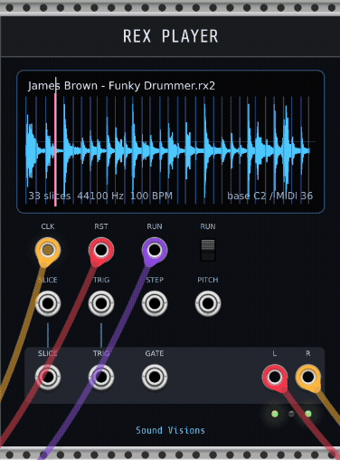

# Sound Visions REX Player

REX Player is a module for VCV Rack 2 that plays REX-family breakbeat loops directly inside a modular patch.



It loads `.rx2`, `.rex`, and `.rcy` files with vendored [VelociLoops](https://github.com/kunitoki/VelociLoops), displays the waveform and slice markers, maps slices to V/Oct notes, and can also run as a clocked REX timing sequencer.

This was created as part of the Hermes Agent creative hackathon. It is already useful, but it is still young software. Save your Rack patches before stress-testing weird files.

## Rack browser

- Brand: `Sound Visions`
- Module: `REX Player`
- Plugin slug/package: `SoundVisions-REXPlayer`
- Tags: `Sampler`, `Drum`, `Sequencer`, `Clock modulator`
- Source repo: https://github.com/gorkulus/rex-player

## What it does

- Loads `.rx2`, `.rex`, and `.rcy` loop files.
- Displays an overview waveform, slice markers, selected slice, and playback cursor.
- Plays selected slices from trigger/gate/MIDI-CV style patches.
- Repitches playback with Rack V/Oct pitch tracking.
- Chokes active playback in mono mode with a short fade to avoid clicks.
- Can use a voice pool when driven by polyphonic cables, but the module is not tagged as a general-purpose polyphonic module.
- Follows original REX slice timing from an external 4x / 16th-note clock.
- Outputs sequenced slice V/Oct, trigger, and gate signals for modular rerouting.

## Quick start

1. Add `REX Player` from the `Sound Visions` brand in Rack's module browser.
2. Right-click the module and choose `Load REX/RX2/RCY...`.
3. Patch `L` and `R` to your mixer.
4. For immediate clocked playback, patch a 4x / 16th-note clock into `CLK`. Leave `SLICE` and `TRIG` unpatched so the internal normaling can drive playback.
5. Optional: patch reset into `RST` and use `RUN` to start/stop the sequencer.

For manual/MIDI-style slice triggering:

1. Patch a V/Oct source into `SLICE`.
2. Patch a trigger or gate into `TRIG`.
3. Set the first-slice MIDI note from the context menu if needed. The default is C2 / MIDI 36.
4. Patch another V/Oct source into `PITCH` if you want independent transposition.

## Documentation

- [Manual](docs/manual.md)
- [Release checklist](docs/release-checklist.md)
- [Legal and licensing notes](docs/legal-and-licensing.md)
- [Third-party notices](THIRD_PARTY_NOTICES.md)
- [Changelog](CHANGELOG.md)

## Build

Rack SDK 2.6.6 was used for the Hermes Agent creative hackathon build. Set `RACK_DIR` to your local Rack SDK path.

```bash
make RACK_DIR=/path/to/Rack-SDK
```

## Package

```bash
make dist RACK_DIR=/path/to/Rack-SDK
```

This creates `dist/SoundVisions-REXPlayer/` and `dist/SoundVisions-REXPlayer-<version>-lin-x64.vcvplugin`.

## Install for local Rack

```bash
rsync -a --delete dist/SoundVisions-REXPlayer/ ~/.local/share/Rack2/plugins-lin-x64/SoundVisions-REXPlayer/
```

Rack scans plugins at startup, so restart Rack after installing or updating the plugin.

## Smoke-test plugin loading

```bash
LD_LIBRARY_PATH=/path/to/Rack-SDK python3 - <<'PY'
import ctypes, os
sdk = '/path/to/Rack-SDK'
plugin = os.path.expanduser('~/.local/share/Rack2/plugins-lin-x64/SoundVisions-REXPlayer/plugin.so')
ctypes.CDLL(os.path.join(sdk, 'libRack.so'), mode=ctypes.RTLD_GLOBAL)
ctypes.CDLL(plugin)
print('dlopen ok')
PY
```

## Smoke-test REX decoding

```bash
mkdir -p build
g++ -std=c++17 -O2 -Ithird_party/VelociLoops/include tools/rex_probe.cpp third_party/VelociLoops/src/velociloops.cpp -o build/rex_probe
./build/rex_probe /path/to/file.rx2
```

## License

REX Player is released under the MIT License. VelociLoops is vendored under The Unlicense. See [LICENSE](LICENSE), [THIRD_PARTY_NOTICES.md](THIRD_PARTY_NOTICES.md), and [docs/legal-and-licensing.md](docs/legal-and-licensing.md).

REX and REX2 are file formats associated with Propellerhead/Reason Studios. Sound Visions REX Player is an independent project and is not endorsed by Propellerhead/Reason Studios.
